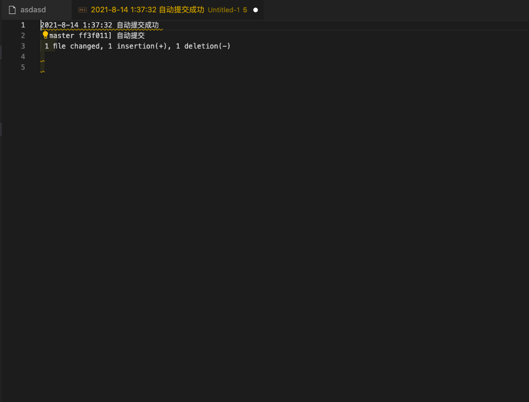

# git-auto-commit 

这是一个可以自动帮你保存代码的插件。在某一次不小心把咖啡洒在了电脑上而诞生。

## Features

核心功能。在最后代码写完最后输入的一小时后。会自动生成一次commit。内容为自动提交。

每次提交都会有日志。



> Tip: 由于vscode中的限制，只能获取到工作区的地址。所以在使用本插件之前你需要点击菜单中的 ```文件->将工作区另存为``` 然后选择你的项目根目录保存工作区文件。git 提交会在工作区文件的同级目录中运行。所以请保证工作区文件和 .git文件为同一个路径。

## 插件设置 


* `git-auto-commit.commitTimeInterval`: 自动commit间隔 默认为最后一次写代码后的 一小时。
* `git-auto-commit.autoPush`: 是否自动推送到当前分支的远程。

## Known Issues

在自动提交的时候有时候会运行两次git commit。

## Release Notes

Users appreciate release notes as you update your extension.

### 0.1.0

Initial release 

### 0.1.1

修复了一些bug。
新增 git commit的时候会跳过检查。
修改 由代码编辑触发更改为保存触发。


**Enjoy!**
